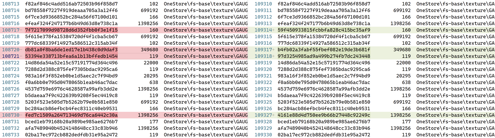
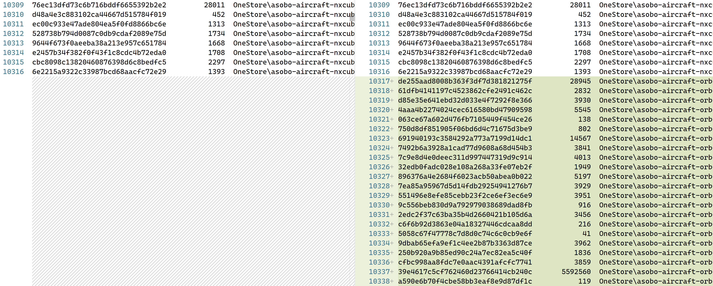
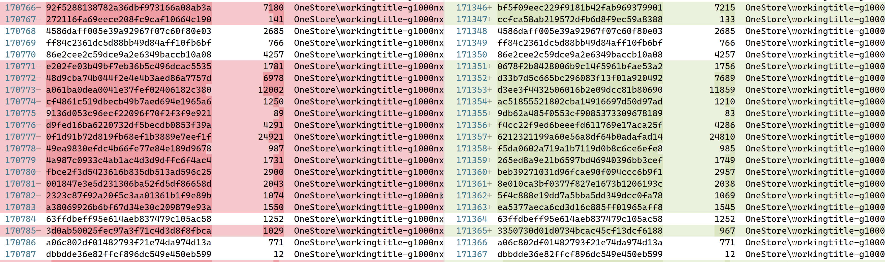

# Comparison Results

## Corrupt files
If there are sporadic files with different hashes, but the same size, these files are likely corrupted.
After uninstalling the relevant package, re-downloading and installing the corresponding package may solve this problem.

## Package not installed
If a lot of files are missing in a row, it is very likely that you have not installed the package in MSFS (or the package has been removed in a newer MSFS version).
If you have access to this package, you can try to install these packages if needed.

## Version mismatch
If there are many consecutive files with different hashes, then there is a good chance that the package has a different version in your MSFS and another user's MSFS.
Trying to find and update may fix this.
